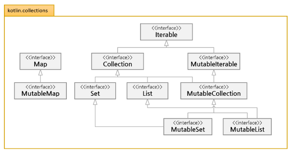
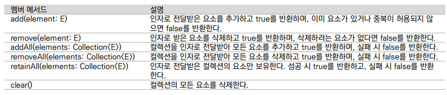
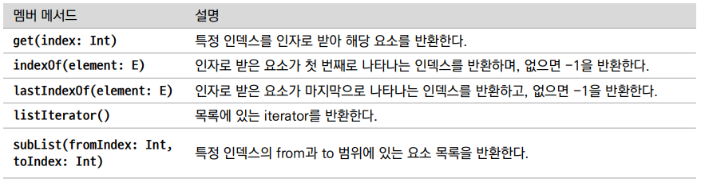
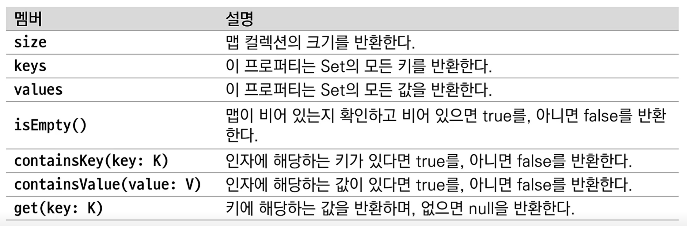
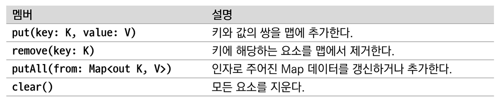

# 컬렉션

## 코틀린의 컬렉션

* 코틀린의 컬렉션은 불변형과 가변형으로 나뉜다.

|컬렉션|불변형(읽기전용)|가변형|
|---|---|---|
|List|listOf|mutableListOf, arrayListOf|
|Set|setOf|mutableSetOf, hashSetOf, linkedSetOf, sortedSetOf|
|Map|mapOf|mutableMapOf, hashMapOf, linkedMapOf, sortedMapOf|


### 코틀린 컬렉션
* 다이어그램의 가장 상위의 Iterable인터페이스는 컬렉션이 연속적인 요소를 표현할수 있게 한다.




## 컬렉션 인터페이스

### 컬렉션 인터페이스 특징
* Iterable 로부터 확장
* 불변형이므로 Collection 으로부터 확장된 Set과 List는 읽기 전용의 컬렉션이 된다.

### 컬렉션 인터페이스의 기본적인 멤버
|멤버|설명|
|---|---|
|size|컬렉션의 크기를 나타낸다|
|isEmpty()|컬렉션이 비어있는경우 true 반환|
|contains()|특정 요소가 있다면 true 반환|
|containsAll|인자로 받아들인 collection 이 있다면 true를 반환|


## MutableIterable 과 MutableCollection 인터페이스

### 특징
* 가변형 컬렉션을 지원하기 위해 준비된 인터페이스
* 요소를 추가하거나 제거하는 등의 기능을 수행할 수 있다.

### MutableCollection의 멤버



## List
### 개념
* 순서에 따라 정렬된 요소를 지니는 컬렉션
* 값을 변경할 수 없는 별변형 List를 만들기 위해 헬퍼 함수인 listOf() 사용
* 값을 변경할 수 있는 가변형을 표현하기 위해 mutableListOf() 사용
* 인자는 원하는 만큼의 가변 인자를 가지도록 vararg로 선언 가능

### 헬퍼 함수란?
* 객체 생성 시 요소를 직접 선언하기 보다 특정 함수의 도움을 통해 생성하기 위한 함수.


### 컬렉션 예제
```kotlin
    var numbers: List<Int> = listOf(1, 2, 3, 4, 5)
    var names: List<String> = listOf("one", "two", "trhee")

    for (name in names) {
        println(name)
    }

    for (num in numbers) print(num)

    //형식 매개변수 생략 경우
    var mixedTypes = listOf("hello", 1, 2.445, 's') // 생략되어있지만 any 가 사용되어 어떤 타입이든 받을수 있다.
```

### 컬렉션에 접근할 때

* indices 를 통한 멤버 접근
```kotlin
    var fruits = listOf("apple", "banana", "kiwi")

    for (index in fruits.indices) { // 인덱스 를 불러올수 있다.
        println("fruit[$index] = ${fruits[index]}")
    }
```


### 기타 list 생성 함수
```kotlin
    // 빈 list 생성
    val emptyList = emptyList<String>()

    // null 을 제외한 요소만 반환
    val nonNullList = listOfNotNull(2, 45, 2, null, 5, null)
    println(nonNullList) // 2, 45, 2, 5
```

### 추가 list 메서드들



## 가변형 List 생성
### arrayListOf() 함수
* 가변형 헬퍼 함수를 사용하면 손쉽게 요소를 추가하거나 삭제할 수 있다.
* arrayListOf() 는 가변형 List를 생성하지만 반환자료형은 자바의 ArrayList 이다.


```kotlin
    val stringList = arrayListOf<String>("hello", "kotlin", "wow")
    stringList.add("java")
    stringList.remove("hello")
    println(stringList) // kotlin, wow, java
```


### mutableListOf() 함수
* 반환자료형은 mutableList 형으로 반환
```kotlin
    // 가변형 list의 생성 및 추가, 삭제, 변경
    val mutableList = mutableListOf<String>("A", "B", "C")
    mutableList.add("D")
    mutableList.removeAt(1) // 인덱스 1 삭제
    mutableList[0] = "G" // 인덱스 0 을 변경, set과 같은 역할
    println(mutableList) 
```

### arrayListOf VS mutableListOf
* ArrayList 는 MutableList 인터페이스를 상속받은 구현체
* ArrayList보다 Kotlin스타일로 리스트를 다루는 인터페이스가 구현되어 있는 MutableList를 사용이 더 나음
* 어차피 Compile Time 에는 ArrayList 든 MutableList 든 ArrayList 로 인식되므로 큰 차이는 없다고 함.
* 일반적으로 MutableList가 좀 더 추상화되어 있어서 아무 '가변 리스트'에 맞기 때문에 사용을 권장한다고 한다


## 불변형 List의 변형
### toMutableList()
```kotlin
    val name = listOf("one", "two", "three")
    
    val mutableName = name.toMutableList()
    mutableName.add("four") // 가변형 으로 변환된 list 에 하나의 요소 추가한다.
```

## Set 생성
### 개념
* 정해진 순서가 없는 요소들의 집합
* 집합의 개념이기때문에 동일한 요소를 중복해서 가질 수 없음

### 생성 헬퍼함수
* 불변형 Set: setOf()
* 가변형 Set: mutableSetOf()


```kotlin
    val mixedTypesSet = setOf("Hello", 5, "world", 3.14) // 자료형 혼합
    var intSet: Set<Int> = setOf(1, 5, 5) // intSet 에는 1, 5만 생성

    val animal = mutableSetOf("lion", "dog", "cat")
    animal.add("dog")

    println(animal) // lion, dog, cat
```

## Set 의 여러가지 자료구조
### hashSetOf() 함수
* 내부적으로 해시 테이블에 요소를 저장할 수 있는 자바의 HashSet컬렉션을 만들수있다
* HashSet은 불변성 선언이 없어서 추가/삭제 등의 기능이 가능하다

### HashSet의 생성
```kotlin
 val intHashSet = hashSetOf(6, 3, 4, 7) // 불변성 기능이 없다.
 intHashSet.add(5)
intHashSet.remove(6) // 삭제 
// 기존 set 과 사용법은 같지만 자료형을 특정지음. 
```
* HashSet은 결과와 같이 입력 순서와 중복된 요소는 무시된다.
* 정렬 기능은 없지만 해시값을 통해 요소를 찾아내므로 검색속도는 O(1) 이다.
  * 필요한 값을 요청과 즉시 바로 찾아낸다.

### sortedSetOf() 함수
* 자바의 treeSet 컬렉션을 정렬된 상태로 반환
* java.utill.* 패키지 임포트 필요
* TreeSet은 저장된 데이터의 값에 따라 정렬
  * 이진 탐색 트리 인 RB 트리 알고리즘을 사용
* HashSet보다 성능이 좀 떨어지고 데이터를 추가하거나 삭제하는 데 시간이 걸리지만 검색과 정렬이 뛰어남

```kotlin
    val intSortedSet: TreeSet<Int> = sortedSetOf(4, 1, 7, 2)
    intSortedSet.add(6)
    intSortedSet.remove(1)
    println(intSortedSet) // 2,4,6,7
    intSortedSet.clear()
    println(intSortedSet) // []
```

### linkedSetOf() 함수
* 자바의 LinkedHashSet 자료형을 반환하는 헬퍼 함수
* 자료구조 중 하나인 링크드 리스트를 사용해 구현된 해시 테이블에 요소를 저장
* HashSet, TreeSet보다 느리지만 데이터 구조상 다음 데이터를 가리키는 포인터 연결을 통해 메모리 공간을 효율적으로 사용 가능.


## Map
### Map의 개념
* 키와 값으로 구성된 요소를 저장
  * 키와 값은 모두 객체
* 키는 중복될 수 없지만 값은 중복 저장될 수 있다.

### Map의 생성
* 불변형
  * mapOf()
* 가변형
  * mutableMapOf()

### 불변형 Map의 생성

```kotlin
val langMap = mapOf(11 to "java", 22 to "Kotlin", 33 to "C++")

    for ((key, value) in langMap) {
        println("key = $key , value = $value ")
    }

    println("langMap[22] = ${langMap[22]}")
    println("langMap.get(22) = ${langMap.get(22)}")
    println("langMap.keys = ${langMap.keys}") // 맵의 모든 key 출력력
```



### 추가/삭제가 가능한 메서드 제공


### 가변형 mutableMapOf() 의 사용

```kotlin
    val capitalCityMap = mutableMapOf("Korea" to "seoul", "china" to "beijing", "japan" to "tokyo")
    println(capitalCityMap.values) // 값만 출력
    println(capitalCityMap.keys) // 키만 출력
    capitalCityMap.put("Uk","London")
    capitalCityMap.putAll(mapOf("US" to "NY"))
```

## Map을 위한 여러가지 자료구조
* Map에서도 자바의 HashMap, SortedMap, LinkedHashMap 을 사용할 수 있다.
* 내부 구조는 앞서 설명한 Set의 구조와 비슷하게 해시, 트리, 링크드 리스트의 자료구조로 구현.
```kotlin
    val hashMap = hashMapOf(1 to "hello", 2 to "world")
    val sortedMap = sortedMapOf(1 to "apple", 2 to "banana")
    val linked = linkedMapOf(1 to "apple", 2 to "banana")
```

## 컬렉션 확장함수
* 코틀린은 컬렉션을 위한 많은 확장함수를 제공한다.
### 확장함수 범주
* 연산자: 더하고 빼는 기능
* 집계: 최대, 최소, 집합, 총합 등의 계산기능
* 검사: 요소를 검사하고 순환하는 기능
* 필터: 원하는 요소를 골라내기 위한 기능
* 변환: 뒤집기 정렬, 자르기 등의 변환기능


```kotlin
   val list1 = listOf("one", "two", "three")
    val list2 = listOf<Int>(1, 2, 3)

    println(list1 + "four") // ["one", "two", "three", "four"] 출력되나 list1 에 four 이 들어간것은 아니다.
    println(list2 + "hello") // [1, 2, 3 "four"] 출력되나 list2 에 four 이 들어간것은 아니고 새로운 list가 생성되어 화면상에 찍히는것.
    println(list2 - 1) // [2, 3]
    println(list1 + listOf("abc"))

    val map1 = mapOf("hi" to 1, "hello" to 2)


    println(map1 + Pair("bye", 3)) // Pair 을 사용한 map 의 요소 추가
    println(map1 - "hello") // hello 키를 가지고있는 값 제거
    println(map1 + mapOf("apple" to 4))
    println(map1 - listOf("hi", "hello")) //list 에 일치하는 key값을 map 에서 제거

    val map2 = map1 + mapOf("apple" to 4)
    println(map2) // {hi=1, hello=2, apple=4}

    val map3 = map1 - listOf("hi")
    println(map3) // {hello=2}
```

### 요소를 집계를 위한 확장함수.

### 요소의 순환
* forEach: 각 요소를 람다식을 처리후 컬렉션을 반환하지 않음
* onEach: 각 요소를 람다식으로 처리한 후 컬렉션을 반환 받음

```kotlin
    val list = listOf(1, 2, 3, 4, 5, 6)
    val map = mapOf(11 to "java", 22 to "kotlin", 33 to "C++")

    list.forEach { print("$it") }
    println()
    list.forEachIndexed { index, value -> println("index[$index]: $value")  } // 매개변수 index 포함

    val returnedList = list.onEach { it * 2 }
    val returendMap = map.onEach { it.value + " language" }

    println(returnedList) // [1, 2, 3, 4, 5, 6]
    println(returendMap) // {11=java, 22=kotlin, 33=C++}

    // onEach : 반복문만 실행하고 원본 collection 을 린턴
```

### 각 요소의 정해진 식 적용
* fold와 reduce 초기값과 정해진 식에 따라 요소에 처리하기 위해
  * fold 는 초기값과 정해진 식에 따라 처음 요소부터 끝 요소에 적용해 값 반환
  * reduce는 fold와 동일하지만 초기값을 사용하지 않음.

```kotlin
    val list = listOf(1, 2, 3, 4)

    println(list.fold(4) { total, next -> total + next}) // 4 + 1 + 2 + 3 + 4

    //foldRight : fold와 같고 마지막 요소에서 처음 요소로 반대로 적용
    println(list.foldRight(4) {total, next -> total + next}) // 4 + 4 + 3 + 2 + 1

    println(list.reduce {total, next -> total + next}) //  1 + 2 + 3+ 4
    println(list.reduceRight {total, next -> total + next}) // 4 + 3 + 2 + 1+
```

## 매핑 관련 연산
### map()
* 주어진 컬렉션의 요소를 일괄적으로 모든 요소에 식을 적용해 새로운 컬렉션을 만든다.
* forEach와는 다르게 주어진 컬렉션을 건드리지 않고 반환값이 있다.

```kotlin
    val list = listOf(1, 2, 3, 4, 5)
    val listWithNull = listOf(1, null, 3, null, 5, null)

    // map: 컬렉션에 주어진 식을 적용해 새로운 컬렉션을 반환
    println(list.map {it * 2}) // [2, 4, 6, 8, 10]

    // mapIndexed: 컬렉션에 인덱스를 포함해 주어진 식을 적용해 새로운 컬렉션 반환
    val mapIndexed = list.mapIndexed {index, it -> index * it} //[0, 2, 6, 12, 20]
    println(mapIndexed)

    // mapNotNull : null 을 제외하고 식을 적용해 새로운 컬렉션 반환
    println(listWithNull.mapNotNull { it?.times(2) }) // [2, 6, 10]
```


### flatMap()
* 요소에 식을 적용한 후 이것을 다시 하나로 합쳐 새로운 컬렉션을 반환
```kotlin
    val list = listOf(1, 2, 3, 4, 5)

    println(list.flatMap { listOf(it, 'A') }) // [1, A, 2, A, 3, A, 4, A, 5, A]
    val result = listOf("abc", "12").flatMap { it.toList() } // [a, b, c, 1, 2]
    println(result)
```

### groupBy()
* 주어진 식에 따라 요소를 그룹화 하고 이것을 다시 Map으로 반환
```kotlin
        val list = listOf(1, 2, 3, 4, 5)

        val grpMap = list.groupBy { if (it % 2 == 0) "even" else "odd" }
        println(grpMap) //{odd=[1, 3, 5], even=[2, 4]}
```

## 요소 처리와 검색 연산
### element 관련 연산
* 보통 인덱스와 함께 해당 요소의 값을 반환
* 식에 따라 처리하거나 인덱스를 벗어나면 null을 반환
```kotlin
    val list = listOf(1, 2, 3, 4, 5, 6)

    // 인덱스에 해당하는 요소 반환
    println("elementAt: ${list.elementAt(1)}") // 2
    println("elementAt: ${list[1]}") // 2

    // 인덱스를 벗어나는 경우 식에 따라 결과 반환 아니면 요소 반환
    println("elementAtOrElse ${list.elementAtOrElse(10, {2 * it})}") // 20
    println("elementAtOrElse ${list.elementAtOrElse(10) {2 * it}}") // 20

    // 인덱스를 벗어나는 경우 null 반환
    println("elementAtORNull: ${list.elementAtOrNull(10)}" ) // null
``` 

## 순서와 정렬 연산
### 컬렉션에 대한 정렬 연산

* reversed()
  * 역순으로 리턴
* sorted() / sortedDescending()
* sortedBy { it % 3 } (조건부 정렬)/ sortedByDescending { it % 3 } // 조건부 따른 내림차순 정렬

## 시퀀스
* 순차적으로 요소의 크기를 특정하지 않고 추후에 결정하는 특수한 컬렉션
* 예를들어 특정 파일에서 줄 단위로 읽어서 요소를 만들때
* 시퀀스는 처리중에 계산하고 있지 않다가 toList()나 count()같은 최종 연산에 의해 결정.

### generateSequence()
* 시드 인수에 의해 시작 요소의 값이 결정
```kotlin
    val nums: Sequence<Int> = generateSequence(2) {it + 1} // 계속 값을 생성해 낸다.

    // take() 를 사용해 원하는 요소 개수만큼 획득
    // toList()를 사용해 list컬렉션으로 반환
    println(nums.take(10).toList()) // [2, 3, 4, 5, 6, 7, 8, 9, 10, 11]
```

* take 함수를 사용해서 중간결과를 가져오는 것일뿐 숫자는 계속해서 만들어 지고 있다.
* 유한한 sequence를 만드려면 null 을 리턴하는 함수를 제공해야한다.
```kotlin
    val nums: Sequence<Int> = generateSequence(2) { if (it < 30) it + 1 else null} // 계속 값을 생성해 낸다.

    println(nums.take(18).toList()) // [2, 3, 4, 5, 6, 7, 8, 9, 10, 11, 12, 13, 14, 15, 16, 17, 18, 19]

    println(nums.count()) // 29
```

### asSequence()
* 시퀀스의 Stream API는 지연 계산을 통해 각 Stream API를 바로 실행하지 않고 나중에 한 원소에 일련의 연산들을 한 번에 시행한다. 그리고 실제로도 빠른 속도를 보이고 있습니다.
* 중간 연산 결과 없이 한 번에 끝까지 연산한 후 결과를 반환
  * filter나 map을 메서드 체이닝해서 사용할 경우 순차적 연산이기 때문에 시간이 많이 걸릴수 있지만, asSequence()를 사용하면 병렬처리가되기 때문에 처리 성능이 좋아진다.


```kotlin
    val list = listOf(1, 2, 3, 4, 5)
    val listDefualt = list.asSequence()
        .map { println("map($it) "); it * it }
        .filter { println("filter($it)" ); it % 2 == 0 }
        .toList() // toList() 를 통해 최종 결과를 list목록으로 반환할 때, 
                  // 모든 연산이 수행되고 결과물이 새로운 리스트인 listDefault에 지정하게 된다.

    println(listDefualt)
```
* 요소의 개수가 많을때만 속도나 메모리 측면에서 좋은 성능을 낼 수 있다.
  * 모든 컬렉션에 대해 sequence Stream API를 사용하면 오히려 컬렉션 Stream API 를 사용하는것 보다 못할수 있다.

* 컬렉션 Stream API
  * 인라인 함수이고 람다를 바로 실행 한다는 특징을 가지고 있다.
* 시퀀스 Stream API 
  * 일반 함수이고 람다를 실행하지 않고 새로운 클래스에 저장하는 특징을 가지고 있다. 
  * lazy 연산을 한다. (최소한의 연산을 한다.)
* 따라서 시퀀스를 사용하게 되면 람다를 실행할 때마다 새로운 (익명) 객체가 생성되는 오버헤드가 있고 컬렉션을 사용하게 되면 람다 실행 후 무조건 스트림을 생성해야 한다는 오버헤드가 있다.
* 람다를 만드는 객체를 생성하는 것의 오버헤드가 큰가,매번 스트림을 생성하는 오버헤드가 큰지를 따져서 asSequence()를 사용해야 한다.
* 출처: https://velog.io/@dhwlddjgmanf/Kotlin-asSequence-vs-non-asSequence